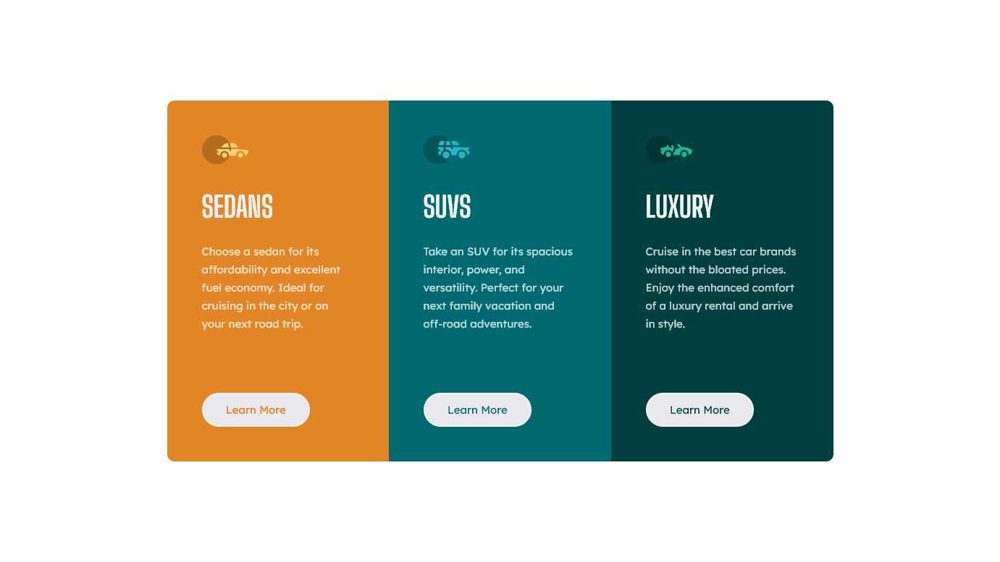

# 3-column preview card component

## Table of contents

-   [Overview](#overview)
    -   [The challenge](#the-challenge)
    -   [Built with](#built-with)
    -   [Links](#links)
    -   [Screenshots](#screenshots)
    -   [Continued development](#continued-development)
-   [Author](#author)

## Overview

Component made with pure HTML and CSS, No third party Libraries.

## The challenge

Your challenge is to build out this 3-column preview card component and get it looking as close to the design as possible.

You can use any tools you like to help you complete the challenge. So if you've got something you'd like to practice, feel free to give it a go.

Your users should be able to:

-   View the optimal layout depending on their device's screen size
-   See hover states for interactive elements

### Built with

-   Semantic HTML5 markup
-   CSS
-   Flexbox

### Screenshots

### Links

-   Solution URL: [Github](https://github.com/NicholasAnich/3-column-card-component)
-   Live Site URL: [Website](https://sunny-biscochitos-037340.netlify.app/)

### Continued development

Improve unecssary css.

## Author

-   GitHub - [@NicholasAnich](https://github.com/NicholasAnich)
-   LinkedIn - [@NicholasAnich](https://www.linkedin.com/in/nick-anich/)
-   Frontend Mentor - [@NicholasAnich](https://www.frontendmentor.io/profile/yourusername)
